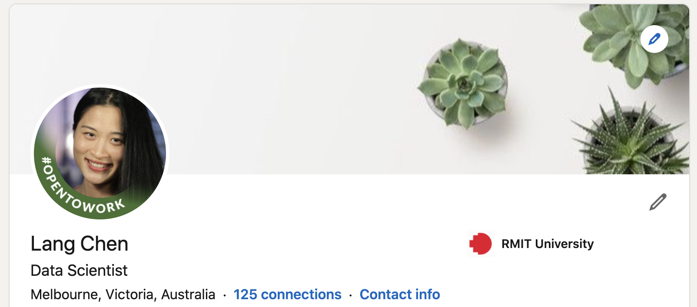
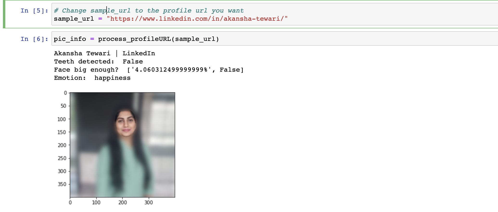
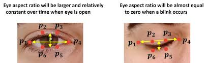
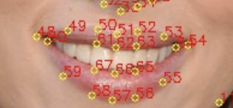
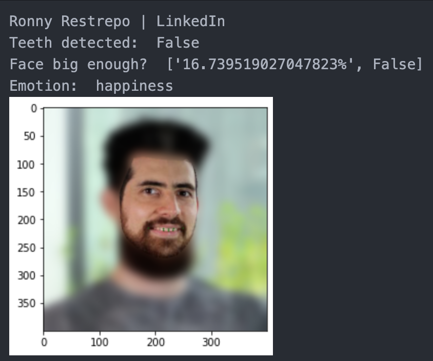

# Tasks
This project aims at creating a image analytics bot to conduct image analytics tasks on any LinkedIn profile picture in an automatic way. 

Given a linkedIn profile url, perform the following tasks on the profile picture.
- Blur the background from the face.
- Identify profiles where the face is at least 50-60% of the overall photo. If it’s less than 50%, then score of face quality being too small.
- Identify if teeth are visible. If so, mention teeth is shown.
- Identity sentiment on face. E.g. smiling / happy, or neutral, sad.


# How to use the code
## Dependencies download
### Creating Python virtual environment
[env](https://docs.python.org/3/library/venv.html)
### Install the packages needed
- requirements.txt
```shell
install -r requirements.txt
```
[Install Dlib](https://www.pyimagesearch.com/2017/03/27/how-to-install-dlib/)

## Credentials setup
### Azure credential
In '*credentials/key_endpoint.py*', replace **KEY** and **ENDPOINT** of Azure Face API.
[Azure Tutorial](https://docs.microsoft.com/en-au/azure/cognitive-services/face/quickstarts/client-libraries?tabs=visual-studio&pivots=programming-language-python)
### LinkedIn Credential
I recommend creating a dummy LinkedIn account for this project, as in the process of mining profile pictures, you might exceed the number of people you can view with your account (Not a problem if you use Premium :D).

In '*scrape/linkedIn_credentials.py*', replace **cookie_value**, **linkedIn_password**, **my_email** with yours.
#### How to access cookie_value
Because of LinkedIn's anti-scraping measures, you must make your selenium browser look like an actual user, and that's also why we couldn't use request for scraping here. To do this, you need to add the **li_at** cookie value to the selenium session.
- Inspect the web page when you're logged in. ("option+command+i" for Mac)
- **Application** -> **Cookies** -> Pick the **www.linkedIn.com** option. -> Copy **li_at** value.

### Manual
Run *'action.ipynb'*, you can change **sample_url** to the profile url you want.


# How I approached the 4 tasks
## Blurring the background from the face
In order to blur the background from the face, we need to locate the facial landmarks on the face boundaries, such as forehead and chin. Unfortunately, in Azure face API, the facial landmarks given only involve eyes, nose and lips, which are not helpful in this case. Therefore, I decided to use Dlib for detecting the face boundary landmarks.

In terms of blurring, OpenCV.GaussianBlur() is used, which is useful in reducing image noise.

## Identify profiles where the face is at least 50-60% of the overall photo
When calculating the area of the overall image, instead of simply using width * height, I use the area of the cropped image. This is because that on a LinedIn profile, the picture is cropped into a circle.

As for calculating the area of the face, I used cv2.contourArea() with the face boundary landmarks detected by Dlib previously.

## Identify if teeth are visible.
**MAR**: Mouth Aspect Ratio
**EAR** : Eye Aspect Ratio

```shell
EAR = (|P2 - P6|+|P3 - P5|) / (2 * |P1 - P4|)
```

Inspired by blink detection, where EAR is used to decide if a person blinks. EAR refers to the average distance of P2 - P6 and P3 - P5 divided by the distance from P1 to P4. The larger EAR, the more likely that the person' eyes are open, not blinking. Similarly, I apply MAR to teeth detected. MAR = lips gap / lips width.

```shell
MAR = (|P61 - P67|+|P62 - P66|+||P63 - P65|) / (3 * |P48 - P54|)
```
After testing on 282 pictures, **0.09** was decided to be the dividing point. Any picture with an **MAR >= 0.09** is predicted to have teeth detected and vice versa.

In order to figure our how MAR works in real life, I performed an independent evaluation on 50 LinkedIn headshots (25 teeth-detected & 25 no-teeth-detected). It turned out that there was a **false negative** rate of 0.04 and a **false positive** rate of 0.16. It works well in general, with a accuracy of 90%, but tend to predict a person without showing teeth to be showing teeth.

Besides, I also found out that it doesn't do well in pictures with mustache and teeth visible. For a debugging purpose, plotting the lower lip bottom landmarks detected by Dlib shows that it tends to mistakenly detect the upper lip bottom landmarks on the teeth. The mistake gives a narrower lips gap and thus a smaller MAR.
For example, please take a closer look to the green dots between lips.




## Identity sentiment on face
**Azure Face client library** has a very convenient interface for detection on a wide range of emotions, such as 'anger', 'contempt', 'disgust', and 'happiness'. Therefore, Azure Face client library is used for sentiment detection here.

## Challenges I encountered
### Scraping picture from LinkedIn profile
LinkedIn has a robust anti-scraping mechanism, so I had to learn how to use Selenium to do the scraping, instead of request, which is what I usually use for a website allowing scraping. If you're interested in how I scrape a LinkedIn profile, please check out the source code 'scrape/scrape_linkedIn.py'.

### Teeth detection
Teeth detection was also quite challenging. Before coming up with the MAR method, I created a predictive model based on the **percentage of smile** and the **ratio between lips gap and thickness of lower lip** which can be both found with Azure Face client library. Upper lip thickness was omitted because sometimes the upper lip is covered when thick and long mustache is present. However, my attempt was not successful, as it gave an accuracy rate around 65%. The code for teeth detection using Azure is in 'Azure_Teeth_Detection' folder.

# References:
1. https://sefiks.com/2020/11/20/facial-landmarks-for-face-recognition-with-dlib/
2. https://github.com/codeniko/shape_predictor_81_face_landmarks
