# Tasks
For any image analytics task, the only approach I tried was to build a predictive model from scratch, which requires a great amount of labeled data. In order to experiemnt conducting image analytics with a more accessible approach, I decided to challenge myself to create an image analytics bot for processing LinkedIn profile pictures. In this project, I wanted to  maximize the potential of [Azure Face API](https://azure.microsoft.com/en-us/services/cognitive-services/face/), as Azure Face API is quite handy for Face detection, smile detection, facial landmark detection, emotion detection, face recognition, etc. It was my first choice for solution to any of the tasks, and [Dlib](http://dlib.net/python/index.html), a facial landmark detector with pre-trained models, turned out to be quite useful when Azure failed to solve my problem.

Given a linkedIn profile url, perform the following 4 tasks on the profile picture:
- Blur the background from the face.
- Identify if the face is at least 25% of the overall photo
- Identity sentiment on face. E.g. smiling / happy, or neutral, sad.
- Identify if teeth are visible.


--------------------------------------------------------------------------------------------

# Scraping the profile picture from LinkedIn

Before we conduct any image analytics on a LinkedIn profile picture, we need to retrieve it from the LinkedIn profile page through web scraping. However, LinkedIn has an extremely robust anti-scraping mechanism. I first tried requests, a python library used to send a GET request to a website to retrieve the content of the webpage. However, the LinkedIn server doesn't allow such request, and it returns a status code of 999, which means 'Request Denied'.

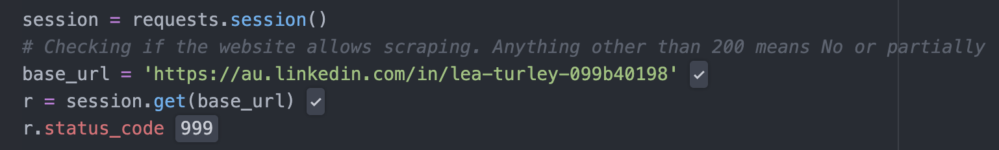

Therefore, I had to switch to Selenium, a tool that allows the scraping bot 🤖 to act in a human-like way on websites, which can fool LinkedIn. With Selenium, I simply provided the email address, password and the cookie value of my LinkedIn session, then selenium handled the whole process from login to LinkedIn, going to any profile webpage and retrieved the profile image url in an automatic way.
If you're interested in how to scrape LinkedIn profile, please check out my source code 'scrape/scrape_linkedIn.py', make sure you have alredy selenium and chromedriver setup in your machine, which is not difficult as there're tons of tutorials online you can follow.

# How I approached the 4 tasks
## Blurring the background from the face
In order to blur the background from the face, we need to locate the facial landmarks on the face boundaries, such as forehead and chin. Unfortunately, in Azure face API, the facial landmarks given only involve eyes, nose and lips, and it's not helpful in this case. Therefore, I decided to use Dlib[1], which can detect 81 facial landmarks, including the boundary landmarks we need.[2] Dlib returns the 81 facial landmarks as a list of 81 (X,Y) tuples, and each represents the position of a landmark on the image. The picture below shows how the 81 facial landmarks is represented.
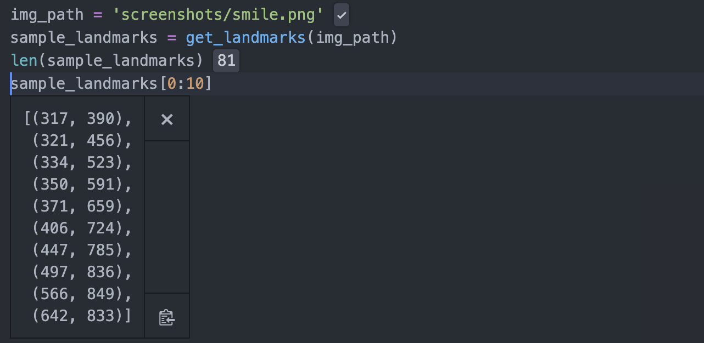

After we locate the facial boundary landmarks, I create a mask using numpy boolean array on the image. The blurring part is done by OpenCV.GaussianBlur(). The code below shows how a mask was created and how blurring was implemented.
```python
def get_mask(img, routes):
    mask = np.zeros((img.shape[0], img.shape[1]))
    mask = cv2.fillConvexPoly(mask, np.array(routes), 1)
    mask = mask.astype(np.bool)
    return mask

def blur_img(img, factor = 20):
   kW = int(img.shape[1] / factor)
   kH = int(img.shape[0] / factor)
   # Instead of a box filter, a Gaussian kernel is used. Good for reducing image noise.
   # Ensure the shape of the kernel is odd
   if kW % 2 == 0: kW = kW - 1
   if kH % 2 == 0: kH = kH - 1
   blurred_img = cv2.GaussianBlur(img, (kW, kH), 0)
   return blurred_img

def blur_background(img, blur_factor, mask):
    blurred_img = blur_img(img, factor = blur_factor)
    blurred_img[mask] = img[mask]
    plt.imshow(blurred_img)
```
The left image shows the facial landmarks detected using Dlib, and the right imgage shows the picture after blurring.
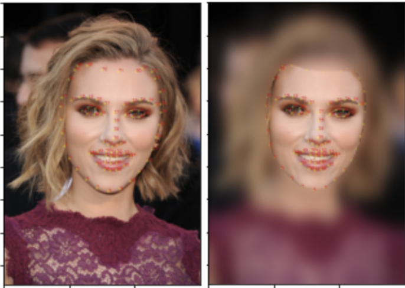
Blurring the background can be used in scenarios such as video conference, when you don't want others to see your messy room. It is sometimes quite necessary in this 'work from home is the new norm' era.


## Identify Profile Picture Quality

There are many factors that affect the quality of a profile picture. But one easily quantifiable and implementable factor is the proportion of the image taken up by the face. The assumption being made here is that if the percentage of area occupied by someones face is too low, then it is dificult to see what they look like. Here we take 25% as the threshold.

One potential application of this is for recruiters, wanting to identify profiles with good quality profile pictures.

In order to accomplish this, we need to calculate both the area of the overall image and the face area. We make use of the facial landmarks identified in the previous section to calculate the area taken up by the face. This is stored as a numpy array, and is passed on to the   open CV function `cv2.contourArea()`, which returns the number of pixels that the face is occupying.

```python
contour_area = cv2.contourArea(np.array(sorted_landmarks))
```

Instead of calculating the overall image size as being the rectangular area (using width * height), I take the area of a cropped circle. This is because on a LinedIn profile, the picture is cropped into a circle. I used the `min(width, height)/2` as the radius in case that the image is a rectangle instead of a square.


The picture below shows the results of calculating the proportion of area taken up by the face, given 2 sample pictures. In the left picture, the face takes up only 5% of the overall image, which is lower than our threshold. In the right picture, the face takes up 27%, which is higher than the threshold.

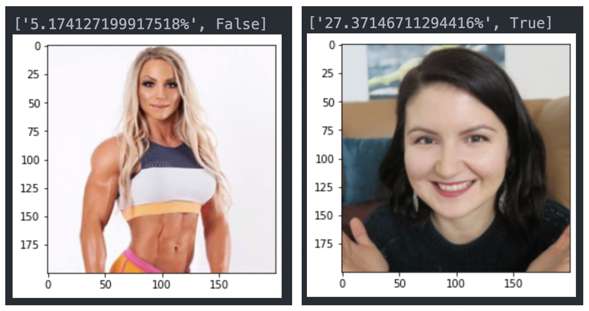


## Identity sentiment on face

It would be interesting to have the computer detect the emotion in peoples faces for us. **Azure Face client library** has a very convenient interface for detection on a wide range of emotions, such as 'anger', 'contempt', 'disgust', and 'happiness'. Therefore, Azure Face client library is used for sentiment detection here. The picture below shows how the sentiment analysis works in real life.
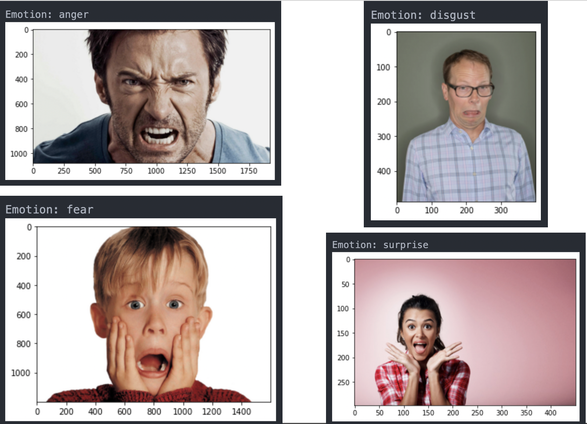

## Identify if teeth are visible.
Although the Azure Face API has detects many things about a face, including sentiment and if someone is smiling, it does not include whether someones teeth is showing.

Instead of training a completely new neural network from scratch, which would also require labelling large amounts of data, I decided to come up with a different workaround that approximates this task.

### First attempt
My first attempt was to make use of the smile index, lips gap, and lower lip thickness returned by Azure Face API. I wanted to create a simple linear regression predictive model based on the lips gap and the ratio between **lips gap** and **lower lip thickness**. The rationale behind is that the bigger smile is, the more likely the person is showing teeth. The lower lips thickness stays constant no matter if we show the teeth or not, but the lips gap can increase a lot when we're happily smiling and show the teeth, which results in change in the ratio.
I collected 282 profile pictures from LinkedIn (in 'face_images' folder), of which 147 showing teeth and 135 not showing teeth. Through Azure Face API, I retrieved the smile index, lower lip thickness and lips distance of each picture. The picture below shows a snap shot of the dataset I created.

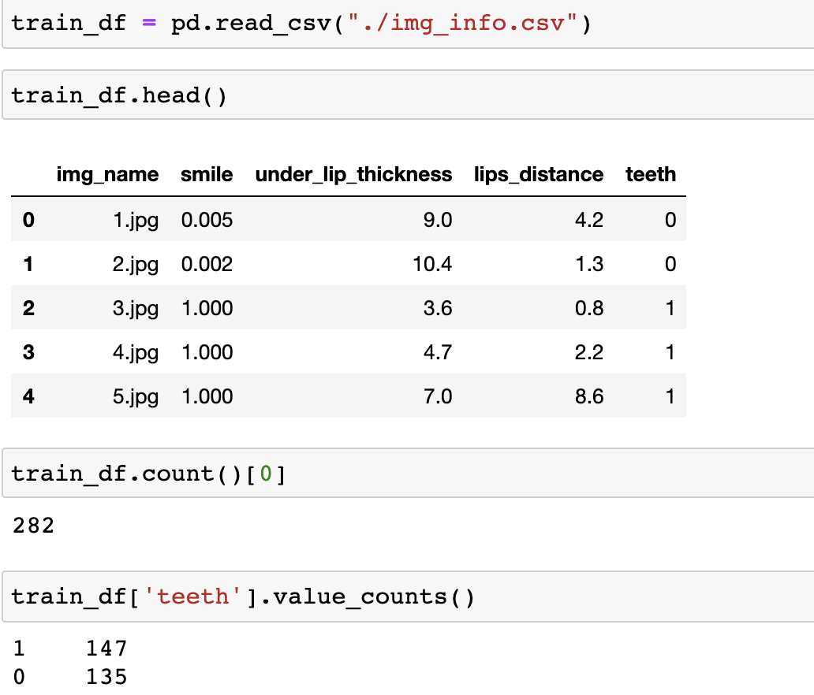


A new column 'ratio' was created with 'under_lip_thickness' and 'lips_distance'. The picture below shows the new df.
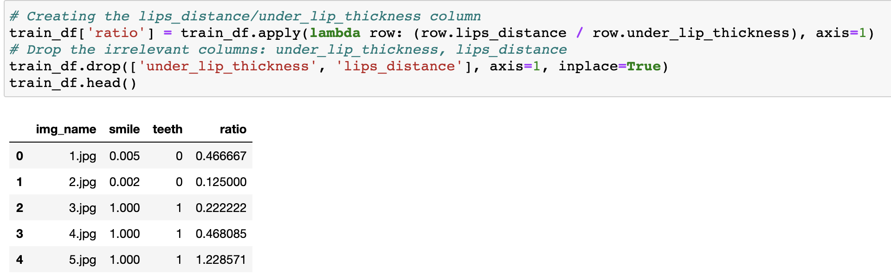

The heatmap below also shows a correlation of 59% between teeth detection and smile index and of 68.9% between teeth detection and ratio of lips gap and lower lip thickness.
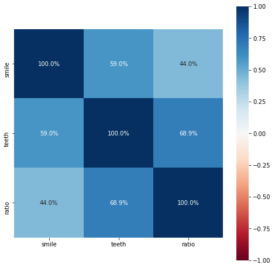

#### Results

The model does well on the training set, and the accuracy rate was 89%. However, after testing the model manually on another 20 LinedIn profile pictures, of which 10 show the teeth, and the rest don't, it gave an accuracy of 65%. I had to abort this attempt, the source code is in 'Azure_Teeth_Detection' folder.

### Second attempt

I was inspired by blink detection, which makes use of a metric called EAR (Eye Aspect Ratio) to decide if a person blinks. EAR is a ratio which compares the distance between upper and lower eyelid realtive to the the width of eye. The width of eye is constant, but the distance between the eyelids can vary, so EAR changes as the eyelids distance does. The larger the EAR is, the more likely that the person' eyes are open, not blinking. When the eye is closed, the EAR is close to 0. The following image gives a visual representation of the EAR calculation, accomanied by code on how it is calculated.


```shell
EAR = (|P2 - P6|+|P3 - P5|) / (2 * |P1 - P4|)
```
Similarly, I created a metric I call MAR (Mouth Aspect Ratio), where `MAR = lips gap / lips width`.[3] A larger MAR value indicates that the mouth is open, and a lower value indicates that the mouth is closed. I make the assumption that if the mouth is open, above some threshold, then it is likely that the persons teeth are also showing. Such an assumtion would not hold if there was a reasonable likelihood that the faces with open mouths expressed surprise, or fright. However, in the case of LinkedIn profile pictures, it is assumed that most faces with an open mouth would be accompanied by a smile. The following image gives a visual representation of the MAR calculation, accomanied by code on how it is calculated.


```shell
MAR = (|P61 - P67|+|P62 - P66|+||P63 - P65|) / (3 * |P48 - P54|)
```

#### MAR threshold

The higher the MAR is, the more likely that teeth is detected. Ideally there's a MAR threshold such that a MAR value above it indicates teeth-detected, and a MAR below it indicates teeth-not-detected. Therefore the **max** MAR of all teeth-not-detected pictures or the **min** MAR of all teeth-detected pictures should be the MAR we're looking for. After testing on 282 pictures, the same data used in the model training of the previous attempt, **0.09** was decided to be the dividing point. Any picture with an **MAR >= 0.09** is predicted to have teeth detected 😬 and vice versa 😐.
The picture below shows the MAR of both a teeth-detected picture and a teeth-not-detected picture respectively.[4]

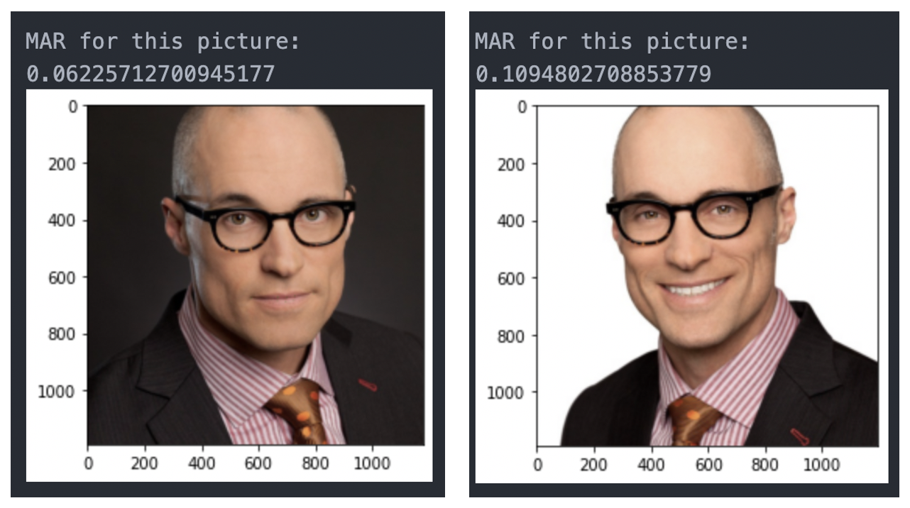

#### Independent evaluation
In order to figure out how MAR works in real life, I performed an independent evaluation on 50 LinkedIn headshots (25 with-teeth & 25 no-teeth). It turned out that there was a **false negative** rate of 0.04 and a **false positive** rate of 0.16. It works well in general, with a accuracy of 90%. The confusion matrix shows the performance using MAR of 0.09. Please refer to the source code in 'teeth_detection_evaluation.py', the images used are in 'evaluation_imgs' folder.
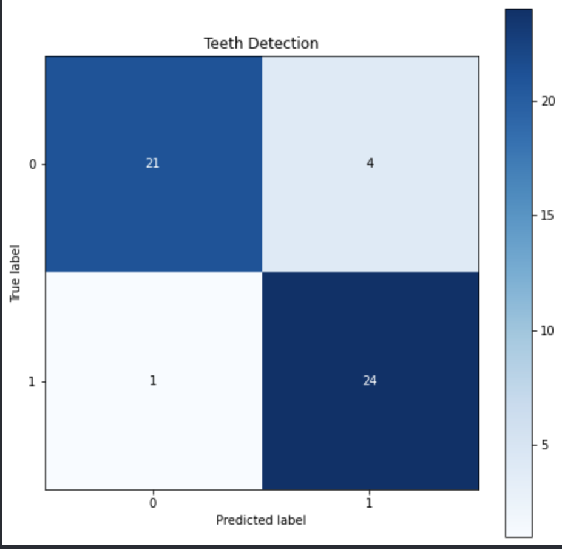

#### Limitations
I found out that it doesn't do well in pictures with mustache and teeth visible. For debugging purpose, I plotted the detected landmarks on upper lip bottom and lower lip top detected by Dlib. It shows that it tends to mistakenly detect the upper lip bottom landmarks on the teeth. The mistake gives a narrower lips gap and thus a smaller MAR.
For example, please take a closer look to the green dots between lips.


#### Potential application
Imagine when you're taking a selfie, instead of setting a timer, it would be great if your camera can detect your most genuine smile 😬 and snap a picture automatically. 🤳🏼 📸 That's when teeth detection can come into use.

# How the script works
In order to demonstrate how the script works for the 4 tasks combined together, I picked 4 sample profile urls, and below is the results.
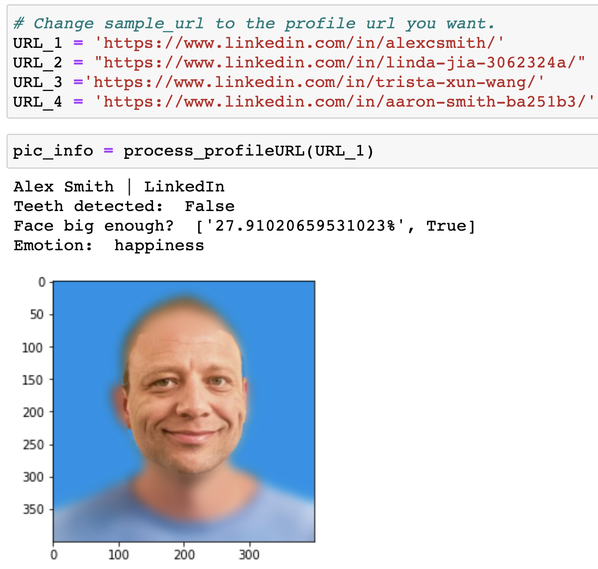
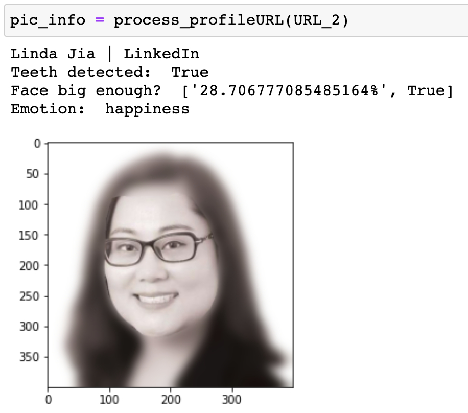
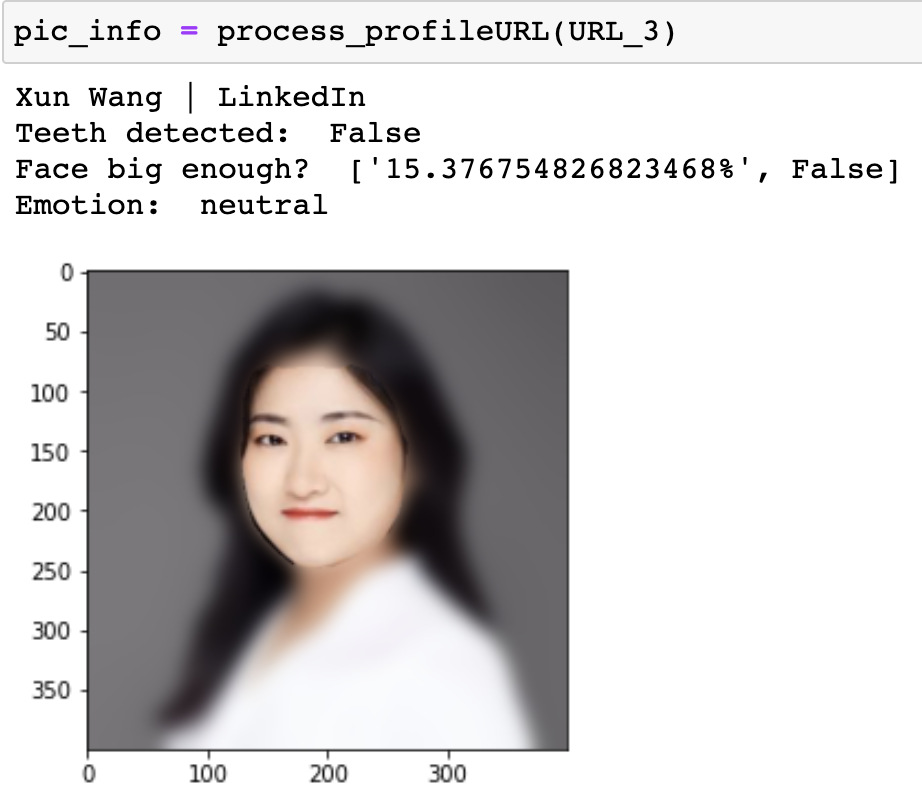
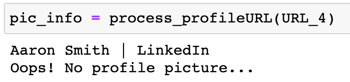

The fourth example shows when a LinkedIn profile doesn't contain a profile picture, it throws an error.

## Code implementation
If you're interested how to implement this project by yoursel, please refer to [code implementation](code_implementation.md)

--------------------------------------------------------------------------------------------

# References:
[1] https://sefiks.com/2020/11/20/facial-landmarks-for-face-recognition-with-dlib/

[2] https://github.com/codeniko/shape_predictor_81_face_landmarks

[3] https://www.freecodecamp.org/news/smilfie-auto-capture-selfies-by-detecting-a-smile-using-opencv-and-python-8c5cfb6ec197/

[4] https://i1.wp.com/blog.scottrklinephoto.com/wp-content/uploads/2014/06/Austin_Hill_Shaw_J2645_Pair.jpg?w=1200
